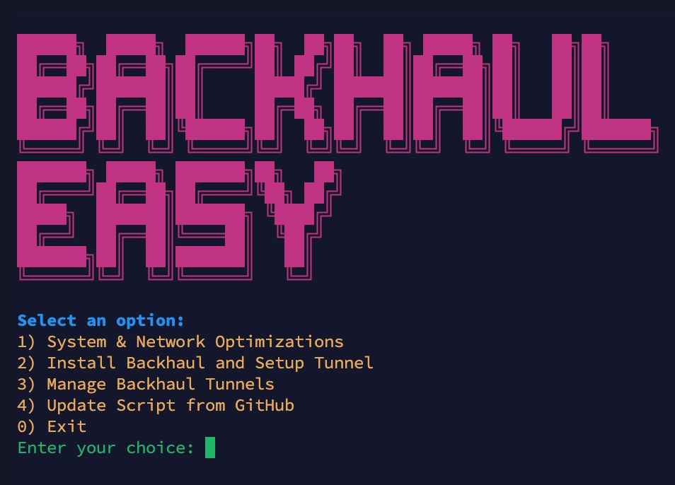

```ascii
 ██████╗  █████╗  ██████╗██╗  ██╗██╗  ██╗ █████╗ ██╗   ██╗██╗     
 ██╔══██╗██╔══██╗██╔════╝██║ ██╔╝██║  ██║██╔══██╗██║   ██║██║     
 ██████╔╝███████║██║     █████╔╝ ███████║███████║██║   ██║██║     
 ██╔══██╗██╔══██║██║     ██╔═██╗ ██╔══██║██╔══██║██║   ██║██║     
 ██████╔╝██║  ██║╚██████╗██║  ██╗██║  ██║██║  ██║╚██████╔╝███████╗
 ╚═════╝ ╚═╝  ╚═╝ ╚═════╝╚═╝  ╚═╝╚═╝  ╚═╝╚═╝  ╚═╝ ╚═════╝ ╚══════╝
 ███████╗ █████╗ ███████╗██╗   ██╗
 ██╔════╝██╔══██╗██╔════╝╚██╗ ██╔╝
 █████╗  ███████║███████╗ ╚████╔╝ 
 ██╔══╝  ██╔══██║╚════██║  ╚██╔╝  
 ███████╗██║  ██║███████║   ██║   
 ╚══════╝╚═╝  ╚═╝╚══════╝   ╚═╝   
```

<div align="center">
  
# 🚀 Backhaul Easy

A powerful and user-friendly CLI tool for managing backhaul configurations with ease.

[](https://github.com/masihjahangiri/backhaul-easy/blob/main/LICENSE)
[](https://github.com/masihjahangiri/backhaul-easy/stargazers)
[](https://github.com/masihjahangiri/backhaul-easy/issues)

</div>

## 🔍 What is Backhaul?

Backhaul is a high-performance reverse tunneling solution that solves a critical problem in modern networking: **NAT traversal and firewall bypass**. 

### The Problem
In today's internet landscape, many devices and servers are behind NAT (Network Address Translation) or firewalls, making direct connections impossible. This creates challenges for:
- Accessing services behind NAT
- Establishing direct connections between devices
- Bypassing network restrictions
- Maintaining stable connections in restricted environments

### The Solution
Backhaul provides a robust solution with:
- Lightning-fast reverse tunneling
- Support for multiple protocols (TCP, UDP, WebSocket)
- High concurrency handling
- Built-in security features
- Easy configuration and management

Backhaul is inspired by [Rathole](https://github.com/rapiz1/rathole) and takes it a step further with enhanced features and performance optimizations.

## 🙏 Acknowledgments

This project is built on top of the amazing [Backhaul](https://github.com/Musixal/Backhaul) project by [Musixal](https://github.com/Musixal). We are deeply grateful for their work in creating this high-performance reverse tunneling solution. This CLI tool aims to make Backhaul more accessible and easier to use while maintaining all its powerful features.

## 🌟 Features

- 📱 Interactive menu-driven interface
- 🔧 System & Network optimizations
- 🔄 Automatic tunnel management
- 🛠️ Easy configuration for both Iran and Kharej servers
- 🔄 One-command installation and updates
- 💻 Cross-platform support (amd64/arm64)

## 🚀 Quick Start

### One-Line Installation

```bash
bash <(curl -Ls https://raw.githubusercontent.com/masihjahangiri/backhaul-easy/main/script.sh)
```

After installation, you can run the tool using:

```bash
bh
```

## 📺 CLI Menu Preview

When you run the tool, you'll be greeted with this interactive menu:



## 🛠️ Main Features

1. **System & Network Optimizations**
   - Automatic sysctl optimizations
   - System limits configuration
   - Network performance tuning

2. **Backhaul Installation & Setup**
   - Easy tunnel configuration
   - Support for both Restricted and Public servers
   - Automatic service management

3. **Tunnel Management**
   - Start/Stop tunnels
   - View logs and status
   - Edit configurations
   - Remove tunnels

4. **Auto-Updates**
   - One-click script updates
   - Automatic version checking

## 🔧 System Requirements

- Linux-based operating system
- Root access
- Active internet connection
- Supported architectures: amd64, arm64

## 📝 Configuration

The tool provides an interactive menu for all configurations. You'll need:

- Port numbers for tunnels
- Token for authentication
- Server IP addresses (for Public server setup)
- Port forwarding rules (for Restricted server setup)

### Server Types

1. **Restricted Server**
   - Located inside a restricted network environment
   - Acts as the server endpoint for the tunnel
   - Handles port forwarding for services
   - Typically behind NAT or firewall restrictions

2. **Public Server**
   - Located outside restricted network environments
   - Acts as the client endpoint for the tunnel
   - Connects to the Restricted Server
   - Typically has public IP access

## 🤝 Contributing

Contributions are welcome! Please feel free to submit issues and pull requests.

1. Fork the repository
2. Create your feature branch
3. Commit your changes
4. Push to the branch
5. Create a new Pull Request

## 📜 License

This project is licensed under the MIT License - see the LICENSE file for details.

## ⭐ Support

If you find this tool helpful, please consider giving it a star on GitHub!

## 🔐 Security

- Always use strong tokens for tunnel authentication
- Keep your system and the script up to date
- Monitor logs regularly for any suspicious activity

---

Made with ❤️ by [Masih Jahangiri](https://github.com/masihjahangiri)
